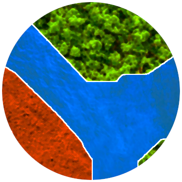

<p align="center">
  

  <h2 align="center">Deepness: Deep Neural Remote Sensing QGIS Plugin</h2>
</p>


[](https://github.com/PUTvision/qgis-plugin-deepness/graphs/contributors)
[](https://makeapullrequest.com)
[](https://github.com/PUTvision/qgis-plugin-deepness/stargazers)
[](https://github.com/PUTvision/qgis-plugin-deepness/network/members)

#### :coffee: :coffee: :coffee: Do you like the plugin? Do you want to keep it maintained? Support us and [buy "coffee"](https://www.buymeacoffee.com/deepness). :coffee: :coffee: :coffee:

Plugin for QGIS to perform map/image segmentation, regression and object detection with (ONNX) neural network models.

## Introduction video

[](https://youtu.be/RCr_ULHHc8A "Video Title")

## Documentation

You can find the documentation [here](https://qgis-plugin-deepness.readthedocs.io/).

## Deepness Model ZOO

Check our example models in the [Model ZOO](./docs/source/main/model_zoo/MODEL_ZOO.md).

## Development

- Install QGIS (the plugin was tested with QGIS 3.12)
  - Debian/Ubuntu based systems: `sudo apt install qgis`
  - Fedora: `sudo dnf install qgis-devel`
  - Arch Linux: `sudo pacman -S qgis`
  - [Windows, macOS and others](https://qgis.org/en/site/forusers/download.html)
- Create virtual environment (with global packages inherited!):

```bash
python3 -m venv venv --system-site-packages
```

- Create a symlink to our plugin in a QGIS plugin directory:

```bash
ln -s $PROJECT_DIR/src/deepness ~/.local/share/QGIS/QGIS3/profiles/default/python/plugins/deepness
```

- Activate the environment and install requirements:

```bash
. venv/bin/activate
pip install -r requirements.txt
```

- Run QGis in the virtual environment:

```bash
export IS_DEBUG=true  # to enable some debugging options
qgis
```

- Enable `Deepness` plugin in the `Plugins -> Manage and install plugins`
- Install and enable:
  - `Plugin reloader` plugin - allows plugins reloading
  - `first aid` plugin - prints stack traces for exceptions

After the plugin code is modified, use the `Plugin reloader` to reload our plugin.

## Unit tests

See [test/README.md](test/README.md)

## Bugs, feature requests and questions

If you encountered some problems or have some feature requests you think will make this project better, consider opening an [issue](https://github.com/PUTvision/qgis-plugin-deepness/issues/new).

If you don't understand something and/or have some questions, ask them in [Discussions](https://github.com/PUTvision/qgis-plugin-deepness/discussions).

## Contributing

PRs are welcome! Read our [General Information for Developers](https://qgis-plugin-deepness.readthedocs.io/en/latest/dev/dev_general_info.html). Consider discussing your plans with maintainers.

## Citation

Is our plugin help you in research? Please cite it:

```
@article{ASZKOWSKI2023101495,
title = {Deepness: Deep neural remote sensing plugin for QGIS},
journal = {SoftwareX},
volume = {23},
pages = {101495},
year = {2023},
issn = {2352-7110},
doi = {https://doi.org/10.1016/j.softx.2023.101495},
url = {https://www.sciencedirect.com/science/article/pii/S2352711023001917},
author = {Przemysław Aszkowski and Bartosz Ptak and Marek Kraft and Dominik Pieczyński and Paweł Drapikowski},
keywords = {QGIS, Deep learning, Remote sensing, Segmentation, Object detection},
}
```
