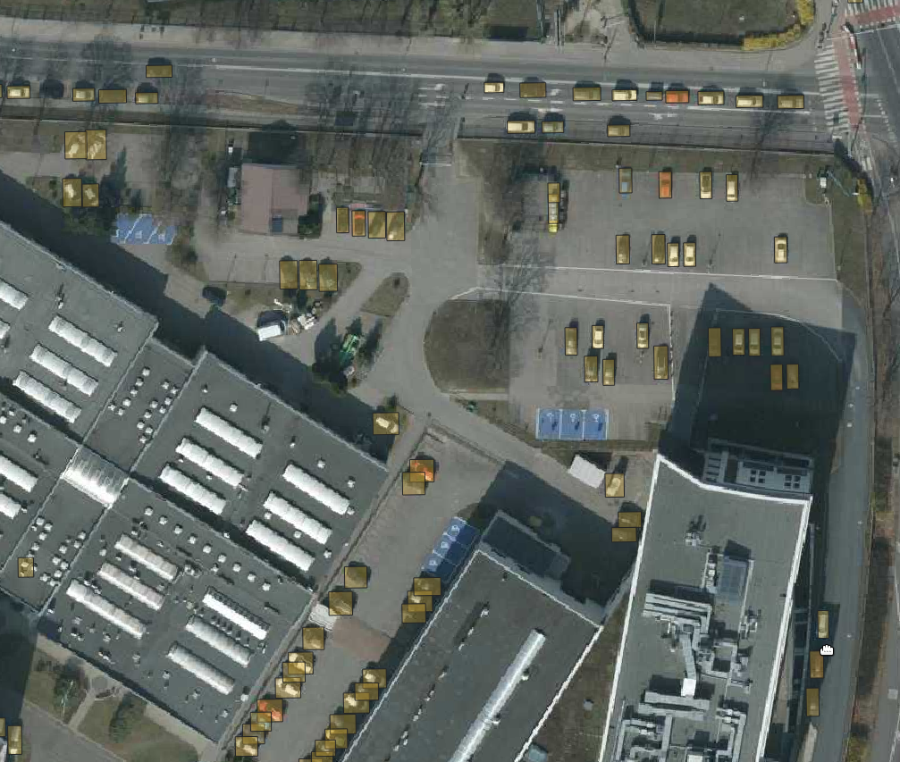

YOLOv7 cars detection
===================================

The following example shows how to use the YOLOv7 model for cars (and other vehicles) detection in aerial or satellite images.

=======
Dataset
=======

The example is based on the `ITCVD cars detection dataset <https://arxiv.org/pdf/1801.07339.pdf>`_. It provides aerial images with 10 cm/px resolution. Annotation bounding boxes for the cars are provided.

=========================
Training tutorial
=========================

The entire training process has been gathered in a tutorial notebook in jupyter notebook:

  .. code-block::

        ./tutorials/detection/cars_yolov7/car_detection__prepare_and_train.ipynb

==================
Example inference
==================

Run QGIS, next add "Poznan 2022 aerial" map using :code:`QuickMapServices` plugin.

Alternatively you can use any other aerial or satellite map with resolution of at least 10 cm/pixel

Then run our plugin and set parameters like in the screenshot below. You can find the pre-trained onnx model at :code:`https://chmura.put.poznan.pl/s/vgOeUN4H4tGsrGm`. Push the Run button to start processing.

Another inference on random street in Poznan:

    .. image:: ../images/cars_on_ransom_street_in_poznan.webp

And output mask for an Grunwald district in Poznan:

    .. image:: ../images/cars_in_poznan_grunwald_district.webp
