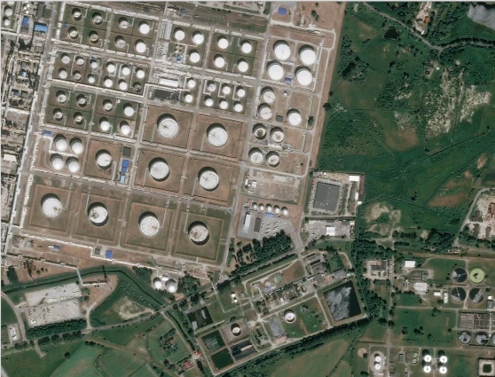
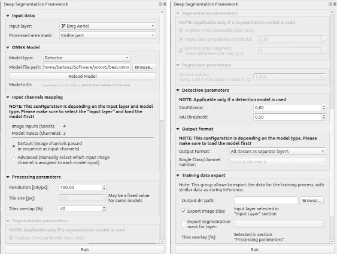

YOLOv5 Oil Storage object detection
===================================

The following example shows how to use the YOLOv5 model for object detection on satellite images.

=======
Dataset
=======

The example is based on the `Airbus Oil Storage Detection dataset <https://www.kaggle.com/datasets/airbusgeo/airbus-oil-storage-detection-dataset>`_. It provides satellite images with 100 cm/px resolution. Annotation bounding boxes for the planes are provided.

=========================
YOLOv7
=========================

We built our pipeline based on the `YOLOv5 repository <https://github.com/ultralytics/yolov5>`_ and using the :code:`yolov5m` config.

==================
Converting to onnx
==================

When model training is completed, export the model using the command below:

.. code::

    python3 export.py --weights best.pt --include onnx --imgsz 512 --simplify
    

==================
Example inference
==================

Run QGIS, next add Bing map using :code:`QuickMapServices` plugin.

Then run our plugin and set parameters like in the screenshot below. You can find the pre-trained onnx model at :code:`examples/yolov5_oils_detection_bing_map/model_yolov5_m_oils_512_1c.onnx` path. Push the Run button to start processing.

After a few seconds, the results are available:

* stats
  
    .. image:: ../images/example_oil_stats.webp

* output layers
  
    .. image:: ../images/example_oil_layers.webp

* predicted mask

    .. image:: ../images/example_oil_output_mask.webp

* predicted mask with Bing map background
  
    .. image:: ../images/example_oil_output_map.webp
