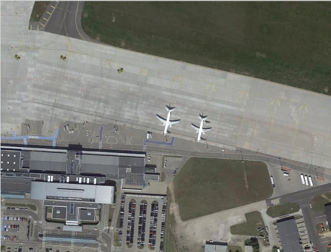
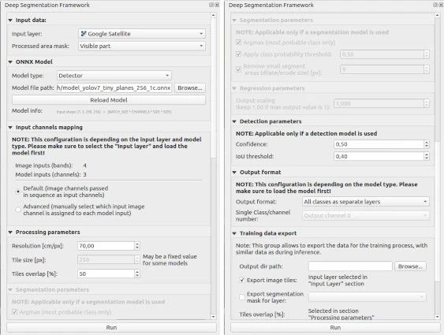

YOLOv7 planes object detection
=========================================

The following example shows how to use the YOLOv7 model for object detection on satellite images.

=======
Dataset
=======

The example is based on the `Airbus Aircraft Detection dataset <https://www.kaggle.com/datasets/airbusgeo/airbus-aircrafts-sample-dataset>`_. It provides satellite images with 50 cm/px resolution. Annotation bounding boxes for the planes are provided.

=========================
YOLOv7
=========================

We built our pipeline based on the `YOLOv7 repository <https://github.com/WongKinYiu/yolov7>`_ and using the :code:`cfg/training/yolov7-tiny.yaml` config.

==================
Converting to onnx
==================

When model training is completed, export the model using the command below:

.. code::

    python export.py --weights yolov7-tiny.pt --grid --simplify --img-size 256 256
    

==================
Example inference
==================

Run QGIS, next add Google Eart map using :code:`QuickMapServices` plugin.

Then run our plugin and set parameters like in the screenshot below. You can find the pre-trained onnx model at :code:`examples/yolov7_planes_detection_google_earth/model_yolov7_tiny_planes_256_1c.onnx` path. Push the Run button to start processing.

After a few seconds, the results are available:

* stats
  
    .. image:: ../images/example_planes_stats.webp

* output layers
  
    .. image:: ../images/example_planes_layers.webp

* predicted mask

    .. image:: ../images/example_planes_output_mask.webp

* predicted mask with Google Earth background
  
    .. image:: ../images/example_planes_output_map.webp