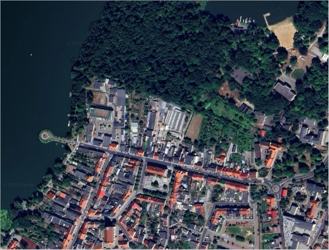
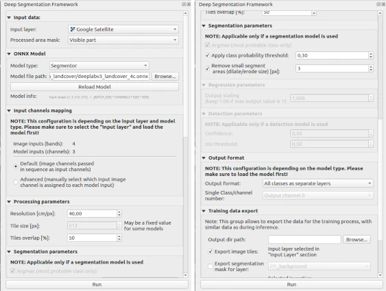

Multiclass LandCover dataset segmentation
=========================================

The following example shows how to prepare the onnx model for field segmentation.

=======
Dataset
=======

The example is based on the `LandCover.ai dataset <https://landcover.ai.linuxpolska.com/>`_. It provides satellite images with 25 cm/px and 50 cm/px resolution. Annotation masks for the following classes are provided for the images: building (1), woodland (2), water(3), road(4).

=========================
Architecture and training
=========================

We built our pipeline based on `Pytorch <https://github.com/pytorch/pytorch>`_, `Pytorch Lightning <https://github.com/Lightning-AI/lightning>`_, and `Pytchorchsegmentation_models.pytorch <https://github.com/qubvel/segmentation_models.pytorch>`_ repository. Our training pipeline is available in [the repository](https://github.com/PUTvision/LandCoverSeg).

* Model :code:`DeepLabV3+` with :code:`tu-semnasnet_100` backend
* Loss function: balanced :code:`FocalDiceLoss`
* Input image size: :code:`512x512`
* Normalization: :code:`1./255.`
* Color order: :code:`RGB`

==================
Converting to onnx
==================

When model training is completed, export the model using the script below:

.. code-block:: 

    model.eval()
    x = next(iter(datamodule.test_dataloader()))[0]

    torch.onnx.export(model,
                      x[:1],  # model input
                      'model.onnx',  # where to save the model
                      export_params=True,
                      opset_version=15,
                      input_names=['input'],
                      output_names=['output'],
                      do_constant_folding=False)

=================
Example inference
=================

Run QGIS, next add Google Earth map using :code:`QuickMapServices` plugin.

Then run our plugin and set parameters like in the screenshot below. You can find the pre-trained onnx model at :code:`examples/deeplabv3_segmentation_landcover/deeplabv3_landcover_4c.onnx` path. Push the Run button to start processing.

After a few seconds, the results are available:

* stats
  
    .. image:: ../images/example_landcover_stats.webp

* output layers
  
    .. image:: ../images/example_landcover_layers.webp

* predicted mask

    .. image:: ../images/example_landcover_output_mask.webp

* predicted mask with Google Earth background
  
    .. image:: ../images/example_landcover_output_map.webp
