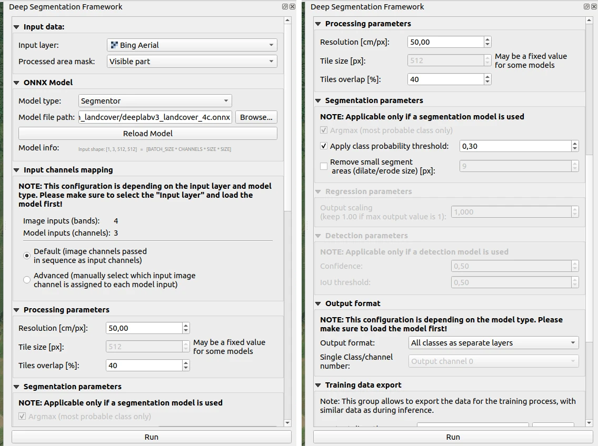

Multiclass LandCover dataset segmentation
=========================================

The following example shows how to prepare the onnx model for field segmentation.

=======
Dataset
=======

The example is based on the `LandCover.ai dataset <https://landcover.ai.linuxpolska.com/>`_. It provides satellite images with 25 cm/px and 50 cm/px resolution. Annotation masks for the following classes are provided for the images: building (1), woodland (2), water(3), road(4).

=========================
Architecture and training
=========================

.. note:: 

    The code will be published as soon as possible.

==================
Converting to onnx
==================

.. code:: 

    model.eval()
    x = next(iter(datamodule.test_dataloader()))[0]

    torch.onnx.export(model,
                      x[:1],  # model input (or a tuple for multiple inputs)
                      'model.onnx',  # where to save the model (can be a file or file-like object)
                      export_params=True,  # store the trained parameter weights inside the model file
                      opset_version=15,  # the ONNX version to export the model to
                      input_names=['input'],
                      output_names=['output'],
                      do_constant_folding=False)

==================
Example inference
==================

