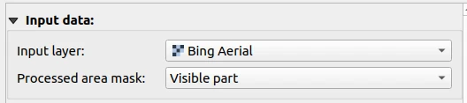
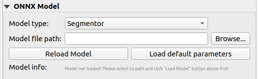
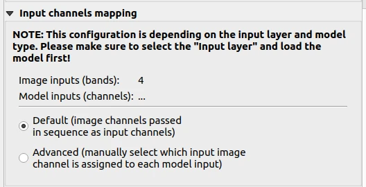
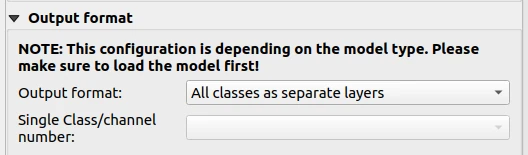
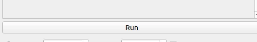
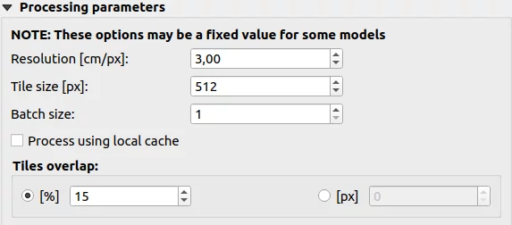
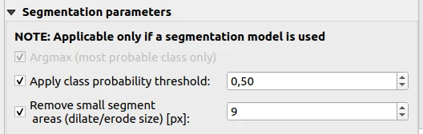
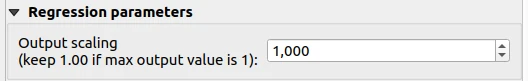
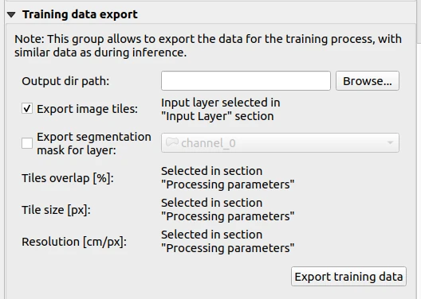

UI explanation
==============

.. note::

   Almost every element in UI has its own 'tooltip', that is a short help message displayed after hovering this element with a mouse cursor for a few seconds.

---------------
Main parameters
---------------

**Input layer**: Most probably this is your orthophoto or map source (like a satellite image from google earth). Needs to be a raster layer.

**Processed area mask**: Defines what part of the input layer should be processed. Options: 
  - Visible Part - allows the processing of the part currently visible on the map canvas.  
  - Entire Layer - allows processing the entire orthophoto file (infinity layers can cause issues).
  - From Polygon - allows selecting a polygon describing the area to be processed (e.g. if the processed field is a polygon, and we don't want to process outside of it).
  .. note:: 
   
     Defines the layer which is being used as a mask for the processing of the Input layer. Only pixels within this mask layer will be processed. Needs to be a vector layer.

**Model type** - Choose the type of the model. Options:
  - Detector - (object detection) allows the prediction of a value for each pixel of the input layer.
  - Regressor - (pixel regression) allows to predict a value for each pixel of the input layer.
  - Segmentor - (mask segmentation) allows the classification of each pixel of the input layer into a class.

**Model file path** - Path to the model file. The model file can be in ONNX format.

**Reload model** - Reloads the model and the metadata from the file.

**Load default parameters** - Loads to the plugin the default parameters from the model file.
   

**Input channels mapping** - Allows to keep the original channel sequence or to change it manually.

**Output format** - Allows to choose the output format. Options:
  - All classes as separate layers.
  - Classes as separate layers.
  - Single class as a vector (you have to select the classes you want to process).

Voilà! You are ready to run the model. Click on the 'Run' button and wait for the results.

---------------------
Processing parameters
---------------------

These options may be a fixed value for some models.

**Resolution** - Size of the images passed to the model in pixels. Usually needs to be the same as the one used during training.

**Tile size** - Defines the processing resolution (in px/cm) of the Input layer Determines the resolution of images fed into the model, allowing to scale of the input images. Should be similar to the resolution used to train the model.

**Batch size** - Number of images passed to the model at once.

**Tiles overlap** - Defines how much tiles should overlap with their neighbors during processing. Especially required for a model which introduces distortions on the edges of images, so that they can be removed in postprocessing. Can be defined in percent of tile size or in pixels.

**Apply class propability threshold** - Minimum required probability for the class to be considered as belonging to this class.

**Remove small segment areas** - Postprocessing option, to remove small areas (small clusters of pixels) belonging to each class, smoothing the predictions. Works as an application of dilating and eroding operation (twice, in reverse order).

**Output scaling** - Scaling factor for model output values. Each pixel value will be multiplied by this factor.

.. image:: ../images/ui_od_param.webp

**Confidence** - Minimal confidence of the potential detection, to consider it as a detection.

**IoU threshold** - Parameter used in Non-Maximum Suppression in post-processing. Defines the threshold of overlap between neighboring detections, to consider them as the same object.

**Remove overlapping detections** - If checked then the overlapping detections (which may be an artifact of overlapped processing) will be removed.

------------
Tiles export
------------

**Output dir path** - Path to the directory where the tiles will be saved.

**Export image tiles** - If checked, the tiles of the layer will be exported.

**Export segmentation mask for layer** - If checked, the segmentation mask (for example result of the model predictions) for the layer will be exported.

